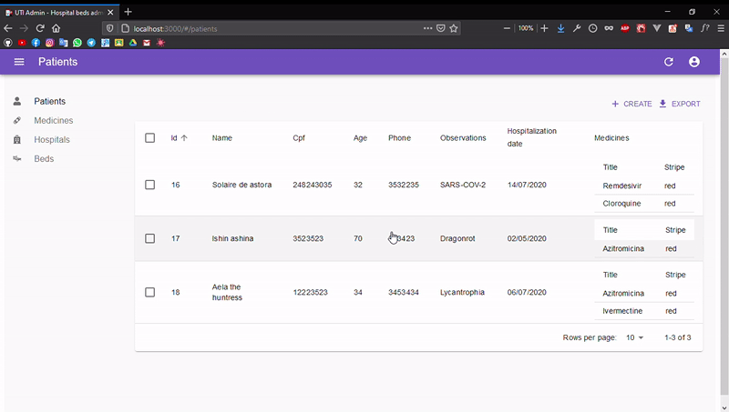
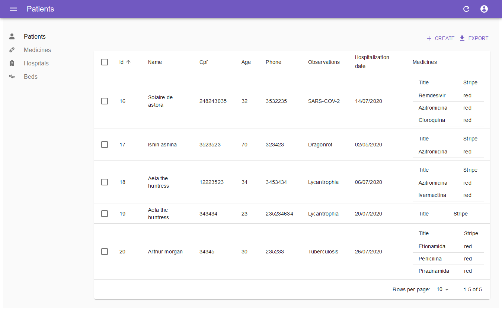
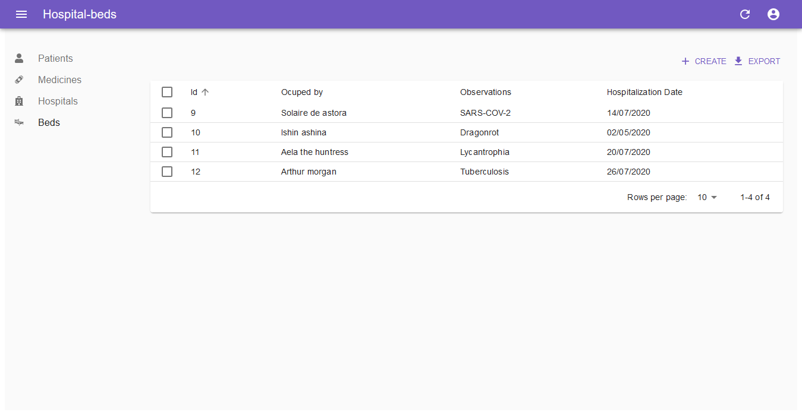
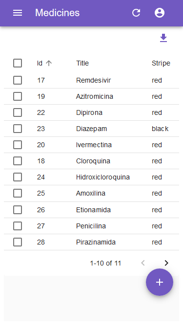
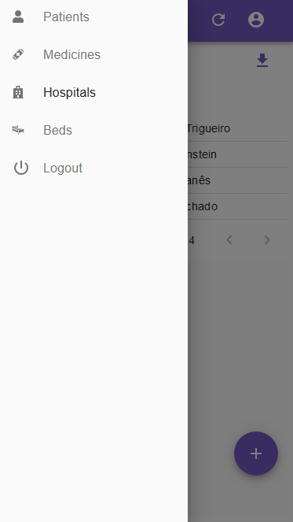
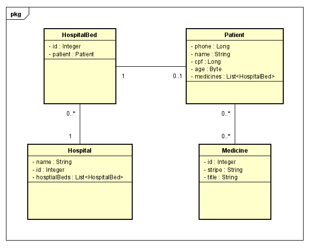
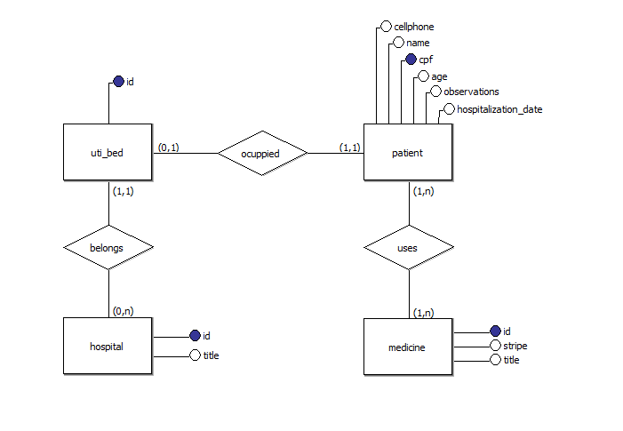

<h2 align="center"> 🏥 Gerenciador de Leitos de UTI</h2>

<h3 align="center"> Desenvolvido Com a Stack

<a href="https://spring.io/projects/spring-boot">
 
Spring Boot,
</a>

<a href="https://pt-br.reactjs.org">
   
  React
</a>, 
e 
<a href="https://marmelab.com/react-admin/">
  
  React Admin
</a>.

</h3>

 
  Este projeto foi desenvolvido como trabalho final da disciplina de Programação Web da 
  faculdade de Análise e Desenvolvimento de Sistemas da <a href="https://ufrn.br/">UFRN</a>

---

<h3> Visual </h3>

   
  
  
  <h3>Responsivo Para Celulares</h3>

   
  

---

<h3> Conhecimentos Aplicados </h3>

- Arquitetura REST

- Conceitos HTTP

- Mapeamento Objeto Relacional (ORM)

- Modelo MVC

<h3>Diagrama de Classes</h3>

  

<h3>Modelo Entidade Relacionamento do Banco de Dados</h3>

  

<h4 align="center"> <em>&lt;/&gt;</em> by <a href="https://github.com/yuredev" target="_blank">yuredev</a> </h4>

